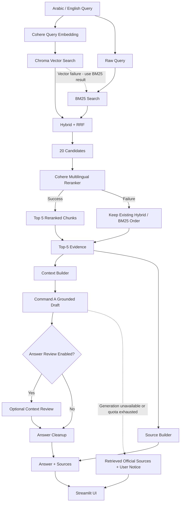
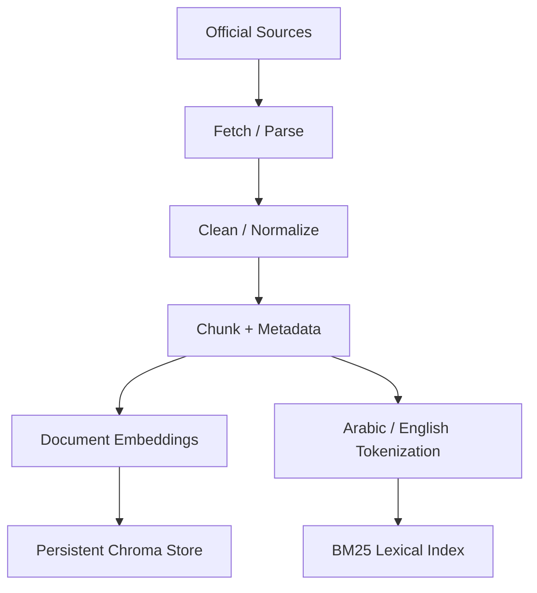
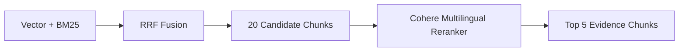
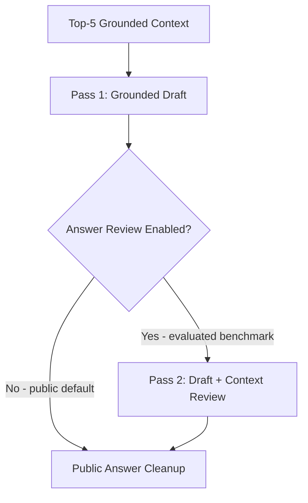
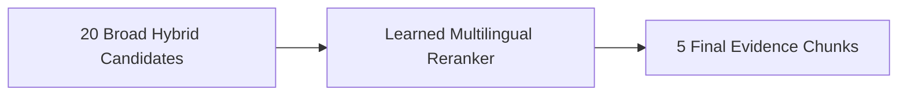
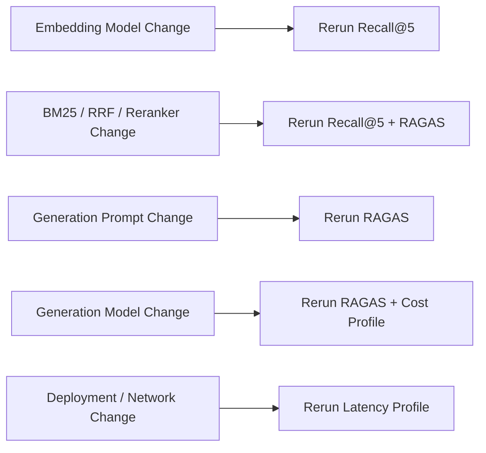

# Yemen Opportunity Navigator RAG

A bilingual, evidence-grounded Retrieval-Augmented Generation (RAG) system for helping Yemeni youth discover scholarships, fellowships, internships, training programs, grants, competitions, startup accelerators, and selected remote/technology opportunities from trusted official sources.

---

## Live Demo

[](https://yemen-opportunity-navigator.streamlit.app)
[](https://huggingface.co/spaces/xmohamedtariq/Yemen-Opportunity-Navigator)
[](https://github.com/xmohamedtariq/Yemen_Opportunity_Navigator_RAG)
---

## Project at a Glance

Yemen Opportunity Navigator is designed as a production-oriented RAG engineering capstone rather than a simple “chat with documents” prototype.

It combines:

- curated first-party opportunity sources;
- bilingual Arabic/English query support;
- Cohere multilingual embeddings;
- persistent Chroma vector search;
- BM25 lexical retrieval;
- hybrid rank fusion with RRF;
- Cohere multilingual reranking;
- top-5 grounded evidence selection;
- one-pass Command A generation by default, with an optional second review pass;
- structured source attribution independent from answer text;
- graceful degradation when external AI services are unavailable;
- quota-aware retry handling and 5-minute caching for identical public queries;
- Streamlit Community Cloud deployment;
- Hugging Face Spaces public presentation mirror;
- Supabase authentication;
- Recall@5 evaluation;
- RAGAS evaluation;
- measured API cost profiling;
- latency profiling;
- four-user cross-device usability testing;
- reproducible engineering evidence and charts.

---

## Key Results

| Metric | Result |
|---|---:|
| Validated processed source records | **49** |
| Searchable chunks | **164** |
| Golden retrieval questions | **30** |
| Final Recall@5 | **100% (30/30)** |
| Arabic Recall@5 | **100% (15/15)** |
| English Recall@5 | **100% (15/15)** |
| Faithfulness | **0.9875** |
| Answer Relevancy | **0.8227** |
| Context Precision | **1.0000** |
| Context Recall | **1.0000** |
| Project arithmetic mean across the four RAGAS metrics | **0.9526** |
| Mean generation cost/query | **$0.01982967** |
| P95 generation cost/query | **$0.02205750** |
| P50 end-to-end latency | **10.945 s** |
| P95 end-to-end latency | **32.381 s** |
| User testing participants | **4** |
| User testing average rating | **9.875/10 (98.75%)** |

> The `0.9526` value is a project-level arithmetic summary of the four RAGAS metric averages. It is not a separate canonical RAGAS metric.

> Cost and latency values above were measured using the **evaluated two-pass generation configuration**. The current public deployment defaults to one Chat generation pass per uncached normal query, with the second review pass optional. Cost values are Command A generation-only; Embed and Rerank usage is measured separately.

---

## Why This Project Exists

Young people in Yemen often need to search many disconnected websites to determine:

- whether applicants from Yemen are eligible;
- application deadlines;
- funding availability;
- academic requirements;
- age restrictions;
- required documents;
- whether opportunities are online or in person;
- whether a program matches their background.

The problem is not only discovery. It is also **verification**.

Yemen Opportunity Navigator addresses this by retrieving evidence from curated official sources before generating an answer, then exposing the supporting source information separately so users can verify important details.

---

## System Architecture


> The architecture diagram reflects the **current production-safe default**: one grounded generation pass per uncached normal query, with the second review pass optional. The RAGAS, cost, and latency values shown in the diagram are historical measured evidence from the evaluated **two-pass benchmark configuration**.

### Query-Time RAG Execution Flow

The following flowchart shows how a live Arabic or English query moves through retrieval, fusion, reranking, grounded generation, source attribution, and production-safe fallback handling.



> **Production reliability:** monthly or trial quota exhaustion is treated as non-retryable. Transient provider/network failures may be retried, vector-search failure falls back to BM25, reranker failure preserves the existing hybrid/BM25 ordering, and generation failure still returns retrieved official sources with a clear user-facing notice.

### Offline Knowledge Ingestion Flow

The offline ingestion pipeline prepares one validated chunk corpus for both semantic vector retrieval and lexical BM25 retrieval.



For a deeper architecture explanation, see:

- [`architecture.md`](architecture.md)
- [`ADR.md`](ADR.md)
- [`docs/technical_evidence.md`](docs/technical_evidence.md)

---

## Corpus

The source collection was designed around **50 candidate source IDs**.

After fetching, parsing, source-quality auditing, replacement where needed, and manual review, the current validated processed corpus contains:

- **49 usable source records**
- **164 searchable chunks**

`OPP-021` is absent from the processed corpus because that candidate source could not be retrieved reliably after repeated access failures.

The corpus focuses on trusted first-party or official sources such as:

- governments;
- universities;
- United Nations organizations;
- international development institutions;
- official scholarship programs;
- technology organizations;
- official innovation/startup programs.

The knowledge categories include:

1. Scholarships
2. Fellowships
3. Internships
4. Training programs
5. Innovation competitions
6. Startup accelerators
7. Grants
8. Remote and technology opportunities

See [`domain.md`](domain.md) for the full domain definition.

---

## Chunking Strategy

The project uses:

```text
RecursiveCharacterTextSplitter
```

with:

```text
Chunk size    = 600 tokens
Chunk overlap = 90 tokens
Overlap       = 15%
Encoding      = cl100k_base
```

Validated chunking result:

```text
Usable processed sources = 49
Total chunks             = 164
Empty chunks             = 0
Very short chunks        = 0
Oversized chunks         = 0
Valid chunks             = 164
```

The goal is to preserve enough opportunity context—such as eligibility, benefits, deadlines, and application requirements—while keeping each retrieval unit focused.

---

## Embeddings

The production embedding model is:

```text
embed-multilingual-v3.0
```

Provider:

```text
Cohere
```

The system distinguishes between:

```text
search_document
search_query
```

- corpus chunks use `search_document`;
- user queries use `search_query`.

A multilingual model is important because users can ask in Arabic while much of the official opportunity corpus is written in English.

---

## Vector Search

The semantic retrieval layer uses:

```text
Chroma
```

with persistent local storage.

The vector store contains:

- 164 indexed chunks;
- 164 vector embeddings;
- metadata for each chunk.

Vector-only retrieval already performs strongly:

```text
29/30 = 96.67% Recall@5
```

---

## BM25 Lexical Retrieval

The lexical retrieval layer uses:

```text
rank_bm25.BM25Okapi
```

with Arabic/English text normalization and tokenization.

BM25 provides a complementary signal for:

- exact program names;
- organization names;
- acronyms;
- dates;
- eligibility phrases;
- precise keywords.

BM25-only performance:

```text
24/30 = 80.00% Recall@5
```

---

## Hybrid Retrieval + RRF

Vector and BM25 results are merged into a broader hybrid candidate pool using reciprocal-rank-fusion-style logic.

Raw hybrid performance:

```text
27/30 = 90.00% Recall@5
```

This is an important engineering result:

> Raw hybrid retrieval did not outperform vector-only retrieval at the final top-five level.

The major improvement came from **reranking the broader hybrid candidate set**.

---

## Cohere Reranking

Reranker:

```text
rerank-multilingual-v3.0
```

Current settings:

```text
Hybrid candidates = 20
Final top_n       = 5
```

Pipeline:



Final retrieval performance:


| Retrieval configuration | Hits | Recall@5 |
|---|---:|---:|
| Vector Search | 29/30 | 96.67% |
| BM25 | 24/30 | 80.00% |
| Hybrid + RRF | 27/30 | 90.00% |
| **Hybrid + Cohere Reranker** | **30/30** | **100.00%** |

Improvement:

```text
Raw Hybrid -> Final Reranked Pipeline
90.00% -> 100.00%
+10.00 percentage points
```

---

## Retrieval by Language

| Language | Hits | Recall@5 |
|---|---:|---:|
| Arabic | 15/15 | 100.00% |
| English | 15/15 | 100.00% |

The final retrieval pipeline did not miss any required gold passage in either language subset.

---

## Retrieval by Difficulty

| Difficulty | Hits | Recall@5 |
|---|---:|---:|
| Easy | 7/7 | 100.00% |
| Medium | 12/12 | 100.00% |
| Hard | 11/11 | 100.00% |

This provides stronger evidence than reporting only the overall score.

---

## Grounded Generation

Generation model:

```text
command-a-03-2025
```

The current public deployment defaults to a single grounded generation pass, while the evaluated two-pass review remains available through:

```env
RAG_ENABLE_ANSWER_REVIEW=1
```

The generation flow is:



The reported RAGAS, cost, and latency benchmarks were produced using this **evaluated two-pass configuration**. The public deployment now defaults to one Chat call to reduce API consumption and latency while preserving the option to reproduce the evaluated path.

Current public default for an uncached normal query:

```text
1 Chat call/query
1 Embed call/query
1 Rerank call/query
```

Evaluated benchmark configuration:

```text
2 Chat calls/query
1 Embed call/query
1 Rerank call/query
```

---

## Production Reliability and Graceful Degradation

The deployed application is designed to continue returning useful evidence when an external AI service is temporarily unavailable.

Current reliability behavior includes:

- monthly/trial quota exhaustion is treated as **non-retryable**;
- only transient provider or network failures are retried;
- vector-search failure falls back to BM25 retrieval;
- reranker failure preserves the existing hybrid/BM25 ordering;
- generation failure returns the retrieved official sources with a user-facing notice instead of failing the entire search;
- identical public queries are cached for **5 minutes** to reduce repeated API calls.

This means the core retrieval experience can remain useful even when AI answer generation is temporarily unavailable.

---

## Source Attribution

Source metadata is constructed separately from answer prose.

The public UI can therefore render:

```text
Answer
+
Official source information
```

instead of relying on the generation model to reconstruct citation metadata.

Source objects can include fields such as:

- title;
- provider;
- category;
- URL;
- source ID;
- chunk IDs;
- rerank score for internal evaluation/debugging.

---

## RAGAS Evaluation

The project evaluates generation quality on **20 questions**:

- Q01–Q20 from the golden set;
- 10 Arabic;
- 10 English.

Each production answer is generated by the real RAG pipeline.

Reference answers are constructed only from manually assigned gold chunks and are instructed not to use outside knowledge.


| Metric | Score |
|---|---:|
| Faithfulness | **0.9875** |
| Answer Relevancy | **0.8227** |
| Context Precision | **1.0000** |
| Context Recall | **1.0000** |

Project arithmetic summary:

```text
0.9526
```


### Interpretation

**Context Precision = 1.0000**  
Relevant evidence is ranked strongly among retrieved contexts.

**Context Recall = 1.0000**  
The retrieved evidence covers the information required by the reference answers.

**Faithfulness = 0.9875**  
Generated claims are almost entirely supported by retrieved evidence.

**Answer Relevancy = 0.8227**  
This is the primary measured quality improvement area. Future work should make answers more direct without sacrificing grounding.

---

## Cost Profiling

The investor cost profiler sends the 30 golden questions through the evaluated two-pass RAG benchmark configuration and records API usage. These measurements describe the configuration used to produce the reported evidence, not the lower-call current public default.

Final benchmark:

```text
Successful questions = 30/30
Failed questions     = 0
```

Measured generation cost:

| Metric | USD/query |
|---|---:|
| Mean | **$0.01982967** |
| P50 | **$0.02006375** |
| P95 | **$0.02205750** |
| Maximum observed | **$0.02419500** |

### Measured API Usage

| Metric | Mean | P50 | P95 | Maximum |
|---|---:|---:|---:|---:|
| Command A input tokens | 7,380.53 | 7,514.50 | 8,246.00 | 8,288.00 |
| Command A output tokens | 137.83 | 119.50 | 310.00 | 358.00 |
| Embedding input tokens | 24.33 | 24.50 | 32.00 | 34.00 |
| Rerank search units | 1.00 | 1.00 | 1.00 | 1.00 |
| Chat calls/query | 2.00 | 2.00 | 2.00 | 2.00 |
| Embed calls/query | 1.00 | 1.00 | 1.00 | 1.00 |
| Rerank calls/query | 1.00 | 1.00 | 1.00 | 1.00 |

### Generation Cost Scaling


| Queries/month | Mean | P95 | Maximum observed |
|---:|---:|---:|---:|
| 1,000 | $19.83 | $22.06 | $24.20 |
| 10,000 | $198.30 | $220.58 | $241.95 |
| 100,000 | $1,982.97 | $2,205.75 | $2,419.50 |
| 1,000,000 | $19,829.67 | $22,057.50 | $24,195.00 |

These values are **generation-only** and were measured with the evaluated two-pass generation configuration. The current public one-pass default is expected to use fewer generation tokens/calls, but a new cost benchmark should be run before reporting replacement production cost figures.

Detailed financial assumptions and production scenarios are documented in:

[`cost_analysis.md`](cost_analysis.md)

---

## Latency Profile

Measured end-to-end latency for the evaluated two-pass benchmark configuration:

| Metric | Seconds |
|---|---:|
| Mean | **13.754** |
| P50 | **10.945** |
| P95 | **32.381** |
| Maximum observed | **70.093** |


The maximum includes transient network/retry effects and must not be interpreted as pure model inference latency.

---

## Arabic vs English Cost

| Language | N | Mean generation cost | P95 generation cost |
|---|---:|---:|---:|
| Arabic | 15 | $0.02097017 | $0.02419500 |
| English | 15 | $0.01868917 | $0.02130250 |

In this benchmark sample, Arabic generation cost was approximately **12.20% higher on average** than English.

This is an observed sample result, not a universal rule.


---

## Arabic vs English Latency

| Language | Mean end-to-end latency |
|---|---:|
| Arabic | 17.198 s |
| English | 10.311 s |


This is a benchmark observation only. The difference may also be influenced by question complexity, response length, network timing, retries, or model behavior.

---

## Authentication

The application includes Supabase-based authentication and session management.

Current capabilities include:

- user registration;
- email/password sign-in;
- session handling;
- username metadata;
- authenticated saved opportunities and search history.

Authentication is kept separate from the RAG retrieval/generation logic. Email-verification behavior is deployment-configurable and depends on Supabase and the configured email-delivery service; temporary email-delivery issues do not affect the core retrieval pipeline.

The production session flow was also hardened to avoid unnecessary repeated token refreshes during Streamlit reruns.

---

## User Testing

The final deployed application was tested by **4 real users** across mobile and desktop devices, with both authenticated and guest usage paths represented.

| User | Device | Access mode | Arabic search | English search | Reviewed main sections | Rating |
|---|---|---|---:|---:|---:|---:|
| User 1 | Mobile | Authenticated | Yes | Yes | Yes | **10/10** |
| User 2 | Mobile | Guest | Yes | Yes | Yes | **10/10** |
| User 3 | Desktop | Authenticated | Yes | Yes | Yes | **10/10** |
| User 4 | Desktop | Guest | Yes | Yes | Yes | **9.5/10** |

Average rating across the four testers: **9.875/10 (98.75%)**.

All four testers successfully used the application in Arabic and English and reviewed the main sections of the interface. One tester suggested that a dark color theme would be preferable; this was recorded as a visual preference rather than a functional issue.

Detailed user-testing notes are documented in [`docs/user_testing.md`](docs/user_testing.md).

---

## Technology Stack

### Application

- Python 3.12
- Streamlit
- Supabase

### RAG

- Cohere `embed-multilingual-v3.0`
- Chroma
- `rank_bm25`
- Reciprocal Rank Fusion
- Cohere `rerank-multilingual-v3.0`
- Cohere `command-a-03-2025`

### Parsing / Processing

- BeautifulSoup
- lxml
- pypdf
- LangChain text splitters
- tiktoken-compatible token counting

### Evaluation

- custom Recall@5 evaluation
- RAGAS
- Cohere evaluation judge
- CSV + Markdown evidence reports
- measured API usage profiling

### Visualization

- Matplotlib

### Deployment / Version Control

- Streamlit Community Cloud — primary application hosting
- Hugging Face Spaces — public static presentation mirror
- GitHub — source code and version control
- Supabase — authentication and user data

> The Hugging Face Space is a static public presentation layer that embeds the deployed Streamlit application. The RAG backend itself continues to run on Streamlit Community Cloud rather than Hugging Face compute.

---

## Repository Structure

```text
Yemen-Opportunity-RAG/
|
|-- ADR.md
|-- architecture.md
|-- cost_analysis.md
|-- domain.md
|-- README.md
|-- .env.example
|-- requirements.txt
|-- sources.csv
|
|-- data/
|   |-- chunks/
|   |-- metadata/
|   `-- chroma/
|
|-- docs/
|   |-- Yemen_Opportunity_Navigator_RAG_Architecture_Decision_Record.pdf
|   |-- technical_evidence.md
|   |-- user_testing.md
|   |-- generate_architecture_diagram.py
|   |-- generate_evidence_charts.py
|   `-- charts/
|       |-- architecture_diagram.png
|       |-- architecture_diagram.svg
|       |-- recall_at_5.png
|       |-- ragas_metrics.png
|       |-- quality_summary.png
|       |-- cost_scaling.png
|       |-- latency_profile.png
|       |-- language_cost.png
|       `-- language_latency.png
|
|-- evaluation/
|   |-- chunk_catalog.csv
|   |-- golden_questions.json
|   |-- recall_eval.py
|   |-- recall_results.csv
|   |-- recall_summary.md
|   |-- ragas_eval.py
|   |-- ragas_results.csv
|   |-- ragas_summary.md
|   |-- refresh_ragas_cache.py
|   |-- investor_cost_profile.py
|   |-- investor_cost_profile.csv
|   `-- investor_cost_summary.md
|
`-- src/
    |-- app.py
    |-- auth.py
    |-- fetch_sources.py
    |-- parse_sources.py
    |-- chunk_sources.py
    |-- audit_processed.py
    |-- audit_chunks.py
    |-- build_vector_store.py
    |-- hybrid_retriever.py
    |-- reranker.py
    |-- provider_utils.py
    `-- rag_pipeline.py
```

---

## Local Setup

### 1. Clone the repository

```powershell
git clone https://github.com/xmohamedtariq/Yemen_Opportunity_Navigator_RAG.git
cd Yemen_Opportunity_Navigator_RAG
```

### 2. Create a virtual environment

Using Python 3.12:

```powershell
python -m venv .venv
```

Activate it:

```powershell
.\.venv\Scripts\Activate.ps1
```

### 3. Install dependencies

Using `uv`:

```powershell
uv pip install --python .\.venv\Scripts\python.exe -r requirements.txt
```

Or standard pip:

```powershell
python -m pip install -r requirements.txt
```

---

## Environment Variables

Create a local `.env` file or configure equivalent deployment secrets.

Example:

```env
COHERE_API_KEY=your_cohere_key

SUPABASE_URL=your_supabase_project_url
SUPABASE_PUBLISHABLE_KEY=your_supabase_publishable_key

APP_URL=http://localhost:8501
```

Optional RAG configuration can be overridden through environment variables where supported by the application, for example:

```env
GENERATION_MODEL=command-a-03-2025
RAG_CANDIDATE_K=20
RAG_TOP_N=5
RAG_MAX_RETRIES=2
RAG_ENABLE_ANSWER_REVIEW=0
```

Do **not** commit secrets.

The repository ignores:

```text
.env
src/.env
.streamlit/secrets.toml
```

---

## Run the Application Locally

From the repository root:

```powershell
streamlit run .\src\app.py
```

Then open the local Streamlit URL shown in the terminal.

---

## Rebuild the Vector Store

If the source/chunk corpus changes:

```powershell
.\.venv\Scripts\python.exe .\src\build_vector_store.py
```

This regenerates document embeddings and writes the persistent Chroma collection.

---

## Run Recall@5 Evaluation

```powershell
.\.venv\Scripts\python.exe .\evaluation\recall_eval.py
```

Primary outputs:

```text
evaluation/recall_results.csv
evaluation/recall_summary.md
```

---

## Run RAGAS Evaluation

```powershell
.\.venv\Scripts\python.exe .\evaluation\ragas_eval.py
```

Primary outputs:

```text
evaluation/ragas_results.csv
evaluation/ragas_summary.md
```

The evaluation can consume paid API resources, so review the script configuration before refreshing the benchmark.

---

## Run the Investor Cost Profile

```powershell
.\.venv\Scripts\python.exe .\evaluation\investor_cost_profile.py
```

Outputs:

```text
evaluation/investor_cost_profile.csv
evaluation/investor_cost_summary.md
```

This benchmark can consume paid API resources. To reproduce the historical cost/RAGAS evidence, use the evaluated two-pass configuration (`RAG_ENABLE_ANSWER_REVIEW=1`). The current public deployment defaults to `0`.

---

## Regenerate Evidence Charts

The documentation chart generator requires Matplotlib.

```powershell
.\.venv\Scripts\python.exe .\docs\generate_evidence_charts.py
```

Architecture diagram:

```powershell
.\.venv\Scripts\python.exe .\docs\generate_architecture_diagram.py
```

---

## Documentation

### Architecture

[`architecture.md`](architecture.md)

Detailed implemented architecture, retrieval pipeline, RAGAS results, cost evidence, latency, limitations, and production evolution.

### Architecture Decision Record

**One-Page Architecture Decision Record:** [PDF](https://github.com/xmohamedtariq/Yemen_Opportunity_Navigator_RAG/blob/main/docs/Yemen_Opportunity_Navigator_RAG_Architecture_Decision_Record.pdf) — [Markdown version](https://github.com/xmohamedtariq/Yemen_Opportunity_Navigator_RAG/blob/main/ADR.md)

The ADR reflects the current resilient production default while preserving the evaluated two-pass configuration used to produce the reported RAGAS, cost, and latency evidence.
### Technical Evidence

[`docs/technical_evidence.md`](docs/technical_evidence.md)

Detailed experimental and engineering evidence, including methodology, formulas, interpretation, trade-offs, limitations, and reproducibility.

### Cost Analysis

[`cost_analysis.md`](cost_analysis.md)

Investor-oriented cost analysis covering measured generation economics, scaling scenarios, infrastructure assumptions, and production planning.

### Domain Definition

[`domain.md`](domain.md)

Project problem, target users, knowledge categories, corpus definition, languages, architecture, and measured evaluation summary.

### User Testing

[`docs/user_testing.md`](docs/user_testing.md)

Four-user usability test covering mobile and desktop devices, authenticated and guest access, Arabic and English searches, section review, and tester feedback.

---

## Engineering Decisions

### Why not vector-only retrieval?

Vector search reached:

```text
96.67% Recall@5
```

This was strong but still missed one golden query.

### Why not BM25-only?

BM25 reached:

```text
80.00% Recall@5
```

It is useful as a complementary lexical signal but insufficient alone.

### Why keep hybrid retrieval if raw hybrid scored 90%?

Because hybrid retrieval is used to create a broader candidate pool.

The reranker then transforms that pool into:

```text
100.00% Recall@5
```

The final decision is therefore:

> Hybrid candidate breadth + learned reranking, rather than raw hybrid ranking alone.

### Why top 20 -> top 5?

This separates candidate recall from final context precision:



The current golden set achieved 100% Recall@5 with this configuration.

### Why is the second Command A review optional?

The evaluated benchmark used two generation passes: a grounded draft followed by a draft-plus-context review. This configuration produced the reported RAGAS, cost, and latency evidence.

The public deployment now defaults to one generation pass because the second pass increases:

- token usage;
- API calls;
- cost;
- latency;
- exposure to provider quota limits.

The review pass remains available through `RAG_ENABLE_ANSWER_REVIEW=1` so the evaluated configuration is reproducible without forcing its extra cost on every public query.

---

## Known Limitations

1. **Answer Relevancy = 0.8227** remains the primary measured quality improvement area.
2. The retrieval benchmark contains 30 questions.
3. RAGAS currently evaluates 20 questions.
4. The current corpus contains 49 usable sources / 164 chunks.
5. The benchmark does not prove identical performance at large production scale.
6. The reported P95 latency of 32.381 seconds belongs to the evaluated two-pass configuration; the current one-pass public default has not yet been re-profiled as a replacement benchmark.
7. Embed/Rerank dollar cost still requires verification against the exact future production pricing model.
8. Opportunity information is time-sensitive; freshness must be monitored separately from retrieval quality.
9. A 100% Recall@5 result on the golden set is not a guarantee for every possible future user query.
10. External providers can impose quotas, rate limits, or temporary outages; the application now degrades gracefully instead of treating generation failure as total search failure.
11. OCR/VLM is not part of the default ingestion path because the current sources are machine-readable. Scanned pages, complex tables, figures, graphs, and other visual content require conditional OCR/VLM processing in future extensions.

---

## Future Production Work

Potential next steps include:

- automated opportunity freshness checks;
- scheduled source refresh;
- alerting for broken official URLs;
- larger multilingual golden sets;
- larger RAGAS test sets;
- stage-level latency telemetry;
- persistent/shared caching beyond the current short-lived public-query cache;
- model routing by query complexity;
- conditional OCR for scanned pages;
- VLM or specialized parsers for complex tables, figures, graphs, and diagrams;
- production-grade email verification/delivery configuration;
- user/query quotas;
- production usage dashboards;
- explicit unit-economics monitoring;
- managed vector infrastructure if scale requires it;
- CI regression evaluation after retrieval/prompt/model changes.

---

## Evaluation Discipline

Architecture changes should trigger the relevant regression tests.



This prevents improvements in one dimension from silently degrading another.

---

## Evidence Snapshot

The main measured evidence documented in this repository was collected during the final capstone engineering phase around:

```text
30 September – 1 October 2026
```

Key Git milestones include:

```text
6e487ae  Add ADR, architecture evidence, and technical documentation
7435677  Add investor-grade cost analysis and measured cost profile
9812765  Add reproducible RAGAS refresh workflow
```

---

## Capstone Deliverables

The five required final deliverables are available as follows:

1. **Public GitHub Repository:** [Yemen Opportunity Navigator RAG](https://github.com/xmohamedtariq/Yemen_Opportunity_Navigator_RAG)

2. **Live Demo:** [Streamlit Community Cloud](https://yemen-opportunity-navigator.streamlit.app)  
   **Additional public access:** [Hugging Face Space](https://huggingface.co/spaces/xmohamedtariq/Yemen-Opportunity-Navigator)

3. **One-Page Architecture Decision Record:** [PDF](https://github.com/xmohamedtariq/Yemen_Opportunity_Navigator_RAG/blob/main/docs/Yemen_Opportunity_Navigator_RAG_Architecture_Decision_Record.pdf) — [Markdown version](https://github.com/xmohamedtariq/Yemen_Opportunity_Navigator_RAG/blob/main/ADR.md)

4. **RAGAS Evaluation on 20 Questions:** 10 Arabic + 10 English, documented in [`evaluation/ragas_summary.md`](evaluation/ragas_summary.md) and the RAGAS section above.

5. **Cost Analysis for 1K / 10K / 100K Queries:** documented in [`cost_analysis.md`](cost_analysis.md) and the cost-scaling section above.

### Additional Validation

**Real User Testing:** [View the 4-user testing report](docs/user_testing.md)

Additional engineering evidence in the repository includes:

- domain definition;
- ingestion pipeline;
- architecture documentation;
- hybrid retrieval + reranking;
- 30-question golden retrieval set;
- Recall@5 evaluation;
- latency evidence;
- technical evidence report;
- reproducible charts;
- public deployment;
- authentication;
- four-user cross-device usability testing.

---

## Author

**Mohammed Tariq AL-Saqqaf**

Yemen Opportunity Navigator was developed as a RAG Engineering capstone focused on building a practical, evidence-grounded opportunity discovery system for Yemeni youth.

---

## Important Use Note

Opportunity deadlines, eligibility rules, benefits, and application links can change.

The assistant is designed to help users discover and understand opportunities, but users should verify time-sensitive application details using the official sources provided by the system before making an application decision.
