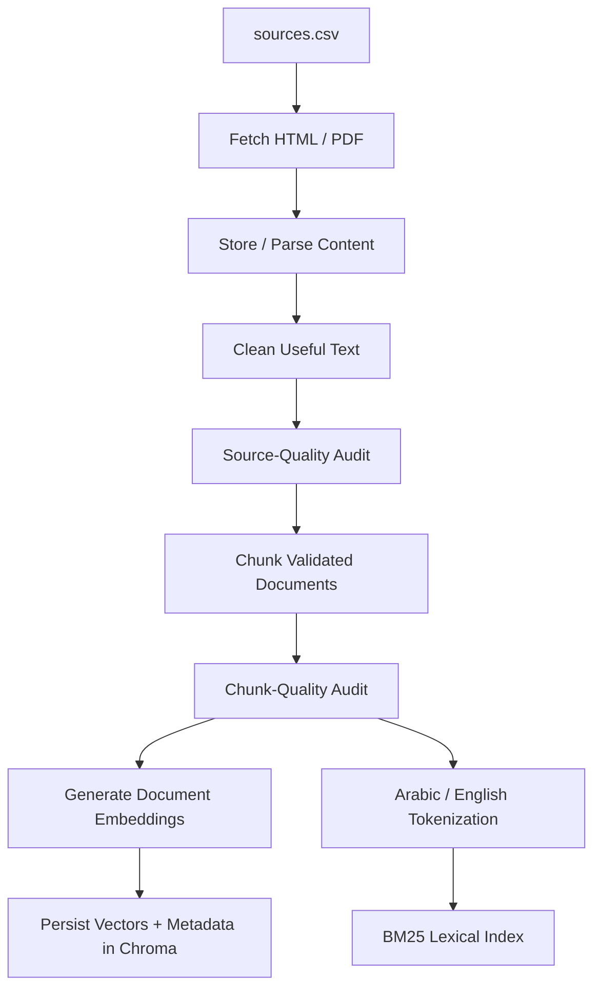
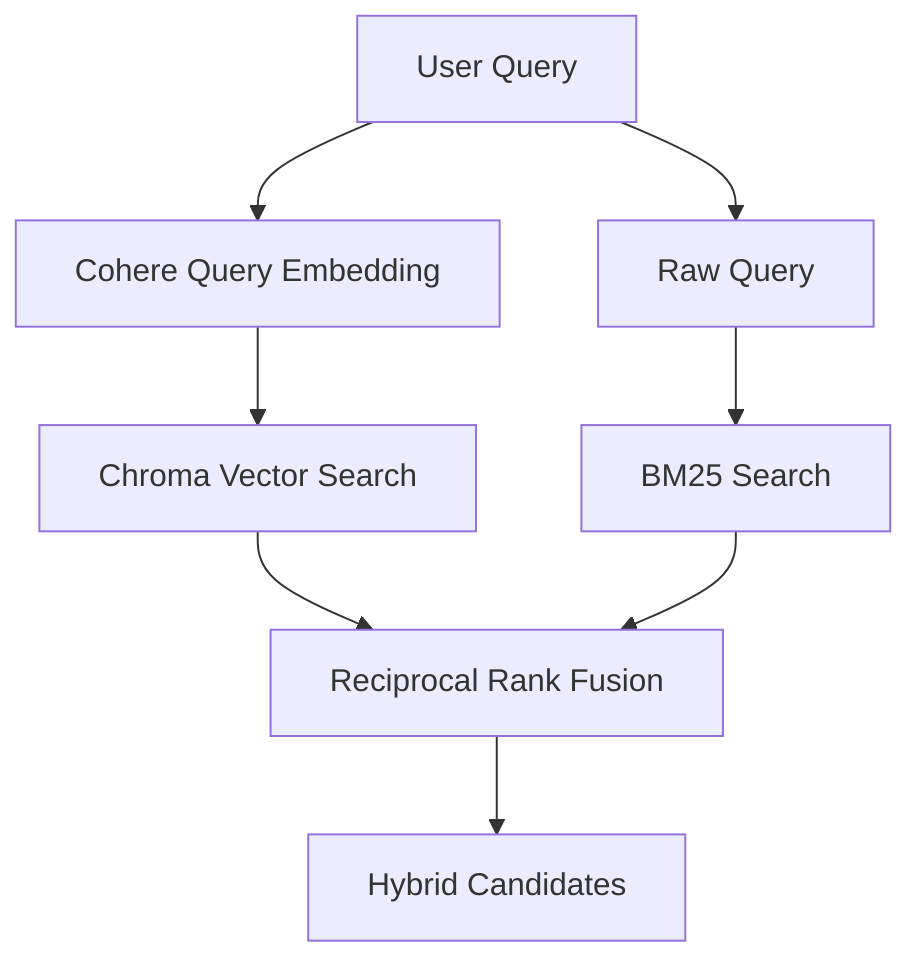
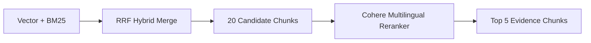
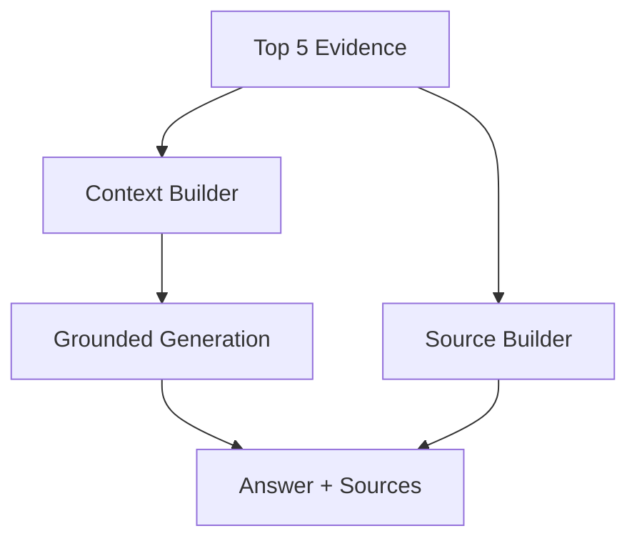
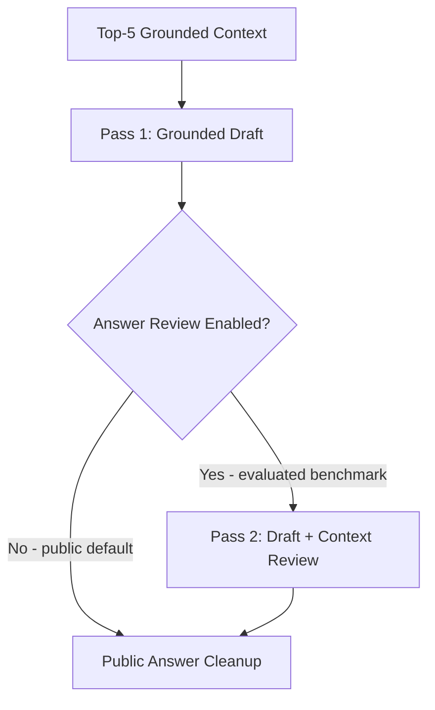

# Yemen Opportunity Navigator — Architecture

**Status:** Implemented and evaluated
**Evidence snapshot:** 30 September–1 October 2026

## 1. Overview

Yemen Opportunity Navigator is a bilingual Retrieval-Augmented Generation (RAG) system that helps Yemeni youth discover and understand trusted scholarships, fellowships, internships, training programs, competitions, grants, startup accelerators, and selected technology/remote opportunities.

The system is designed around a simple rule:

> Retrieve and rank source evidence first, then generate an answer from that evidence and expose the supporting sources separately.

The current validated corpus contains **49 usable processed source records** and **164 searchable chunks**.

The source collection originally contained 50 candidate source IDs. One candidate, `OPP-021`, is absent from the processed corpus after repeated retrieval failures.

## 2. Architecture Diagram


> **Version note:** The chart highlights the current production-safe architecture: **one grounded Command A draft by default**, with the second draft-plus-context review available only when `RAG_ENABLE_ANSWER_REVIEW=1`. The reported RAGAS, cost, and latency benchmarks were collected on the evaluated **two-pass** configuration for reproducibility.

The architecture has two major execution phases:

1. offline knowledge-base ingestion;
2. online query-time retrieval, reranking, generation, and source rendering.

Measured quality, cost, and latency are evaluated separately. Retrieval quality applies to the current retrieval stack; the reported cost and latency evidence corresponds to the evaluated two-pass benchmark path, while the public deployment now defaults to one Chat generation pass for better resilience and lower cost.

## 3. Offline Ingestion

The ingestion pipeline is:



The corpus also feeds a BM25 lexical index.

### Parsing

HTML parsing uses BeautifulSoup with the `lxml` parser.

Non-content elements such as scripts, styles, `noscript`, SVG, iframe, and button elements are removed where appropriate.

The parser preserves HTML forms because some Microsoft SharePoint pages place relevant page content inside form elements. SharePoint-specific extraction is also supported for `.ms-rtestate-field`.

PDF parsing support is included for PDF sources.

## 4. Chunking Strategy

The implemented chunking strategy uses:

```text
RecursiveCharacterTextSplitter
```

Configuration:

- chunk size: **600 tokens**;
- chunk overlap: **90 tokens**;
- overlap: **15%**;
- token encoding: `cl100k_base`.

### Rationale

A 600-token chunk is large enough to preserve meaningful descriptions, eligibility conditions, benefits, and application details while remaining focused enough for retrieval.

The overlap reduces the probability that important evidence is split across chunk boundaries.

### Validated result

- usable processed sources: **49**;
- searchable chunks: **164**;
- empty chunks: **0**;
- very short chunks: **0**;
- oversized chunks: **0**;
- valid chunks: **164**.

## 5. Metadata

Each indexed chunk retains source metadata so retrieval results can be traced to the original source.

Metadata can include:

- `chunk_id`;
- `source_id`;
- `chunk_index`;
- title;
- provider;
- category;
- URL.

The generation pipeline builds source attribution separately from answer prose so the UI can display official-source information without relying on the LLM to reconstruct citations.

## 6. Embeddings

Selected model:

```text
embed-multilingual-v3.0
```

Provider:

```text
Cohere
```

The implementation distinguishes between:

```text
search_document
search_query
```

Document chunks use `search_document`; incoming questions use `search_query`.

### Rationale

The application must accept Arabic and English queries while many source documents are written primarily in English. A multilingual model supports cross-lingual semantic retrieval.

OpenAI `text-embedding-3-small` was considered during development, but a quota limitation prevented a valid empirical comparison. No unsupported claim is made that one embedding model outperformed the other.

## 7. Vector Database

Selected database:

```text
Chroma
```

Collection:

```text
yemen_opportunities
```

Distance function:

```text
cosine similarity
```

Persistent database location:

```text
data/chroma/
```

### Rationale

Chroma is appropriate for the current corpus because it:

- provides persistent local storage;
- integrates well with Python/LangChain;
- supports metadata;
- has no separate managed-vector-database service dependency for this capstone scale;
- can later be replaced if scale/concurrency requirements justify migration.

The current vector store contains:

- 164 text chunks;
- 164 vector embeddings;
- source metadata for every indexed chunk.

## 8. BM25 Lexical Retrieval

The lexical retrieval path uses:

```text
BM25Okapi
```

with Arabic/English text normalization and tokenization.

BM25 is retained because exact lexical signals remain useful for:

- program names;
- organizations;
- acronyms;
- dates;
- eligibility phrases;
- precise terms.

BM25 receives the raw query text; it does **not** depend on the semantic query embedding.

## 9. Hybrid Retrieval

At query time two retrieval signals run:



The hybrid merge broadens candidate coverage before the learned reranking stage.

## 10. Reranking

Selected model:

```text
rerank-multilingual-v3.0
```

Current settings:

```text
Hybrid candidate count = 20
Final top_n = 5
```

Query-time path:



The reranker is a critical part of the final architecture because raw hybrid fusion alone did not outperform vector-only retrieval on Recall@5.

## 11. Retrieval Evidence

Measured 30-question golden-set results:

| Retrieval method | Hits | Recall@5 |
|---|---:|---:|
| Vector Search | 29/30 | 96.67% |
| BM25 | 24/30 | 80.00% |
| Hybrid (Vector + BM25 + RRF) | 27/30 | 90.00% |
| **Hybrid + Cohere Reranker** | **30/30** | **100.00%** |

The evidence supports the following conclusion:

> The decisive improvement comes from reranking the broader hybrid candidate set, not from raw hybrid fusion alone.

Final pipeline results by language:

| Language | Hits | Recall@5 |
|---|---:|---:|
| Arabic | 15/15 | 100.00% |
| English | 15/15 | 100.00% |

Final pipeline results by difficulty:

| Difficulty | Hits | Recall@5 |
|---|---:|---:|
| Easy | 7/7 | 100.00% |
| Medium | 12/12 | 100.00% |
| Hard | 11/11 | 100.00% |


## 12. Context Construction

The top-five reranked chunks are transformed into grounded generation context.

The context includes retrieved text and source metadata.

The same retrieved evidence also feeds the source-attribution builder.

Conceptually:



## 13. Generation

Generation model:

```text
command-a-03-2025
```

The current **public deployment default** uses one grounded generation pass. A second draft-plus-context review remains available for reproducibility and quality experiments through:

```env
RAG_ENABLE_ANSWER_REVIEW=1
```

The generation path is:



The second pass is an explicit quality/cost/latency trade-off.

Current public default for an uncached normal query:

- Chat calls/query: **1**;
- Embed calls/query: **1**;
- Rerank calls/query: **1**.

Evaluated benchmark configuration:

- Chat calls/query: **2**;
- Embed calls/query: **1**;
- Rerank calls/query: **1**.

## 13.5 Production Reliability

The deployed application is intentionally resilient when a third-party AI dependency becomes temporarily unavailable.

Current behavior includes:

- monthly/trial quota exhaustion is treated as **non-retryable**;
- only transient provider/network failures are retried;
- vector-search failure falls back to BM25;
- reranker failure preserves the existing hybrid/BM25 ordering;
- generation failure returns the retrieved official sources with a user-facing notice instead of failing the entire search.

This means retrieval and source evidence can still be delivered even when AI answer generation is temporarily unavailable.

## 14. Public Answer and Sources

The answer-cleanup stage removes internal implementation/debugging language before content reaches the public application.

Source attribution is produced separately from answer text.

This allows the Streamlit UI to render:

```text
Answer
+
Official source cards / source metadata
```

instead of relying on the generation model to fabricate citation metadata.

## 15. Application and Authentication

The current application layer uses:

```text
Streamlit
```

for the web interface and:

```text
Supabase
```

for authentication/session management.

Authentication is intentionally separate from the retrieval/generation pipeline.

## 16. RAGAS Evaluation

RAGAS evaluation uses 20 questions from the 30-question golden set:

- Q01–Q20;
- 10 Arabic;
- 10 English.

Production answers are generated through the real application RAG pipeline.

Reference answers are generated only from manually assigned gold chunks and are instructed not to use outside knowledge.

Measured results:

| Metric | Score |
|---|---:|
| Faithfulness | **0.9875** |
| Answer Relevancy | **0.8227** |
| Context Precision | **1.0000** |
| Context Recall | **1.0000** |

Project-level arithmetic mean:

```text
0.9526
```

This mean is a project summary across the four metric averages; it is not a separate canonical RAGAS metric.


### Interpretation

The strongest evidence is:

- Context Precision = 1.0000;
- Context Recall = 1.0000;
- Faithfulness = 0.9875.

The main measured answer-quality weakness is:

```text
Answer Relevancy = 0.8227
```

Future prompt/model optimization should therefore focus on more direct answers without reducing grounding.

## 17. Cost Evidence

The production cost profiler completed:

```text
30/30 successful queries
```

Generation cost distribution:

| Metric | USD/query |
|---|---:|
| Mean | $0.01982967 |
| P50 | $0.02006375 |
| P95 | $0.02205750 |
| Maximum observed | $0.02419500 |

These are **Command A generation-only** values.

The benchmark also measures Embed tokens and Rerank search units, but their dollar prices are intentionally not inserted into the full variable-cost calculation until verified production rates for the exact deployed models are available.


Detailed financial modeling is maintained in:

```text
cost_analysis.md
```

## 18. Latency Evidence

Measured end-to-end latency:

| Metric | Seconds |
|---|---:|
| Mean | 13.754 |
| P50 | 10.945 |
| P95 | 32.381 |
| Maximum | 70.093 |


The maximum includes observed network/retry effects and must not be interpreted as pure model-inference latency.

## 19. Language-Level Operational Evidence

Measured generation cost:

| Language | Mean generation cost | P95 generation cost |
|---|---:|---:|
| Arabic | $0.02097017 | $0.02419500 |
| English | $0.01868917 | $0.02130250 |


Measured mean end-to-end latency:

| Language | Mean latency |
|---|---:|
| Arabic | 17.198 s |
| English | 10.311 s |


These are benchmark observations and are not interpreted as universal causal effects of language.

## 20. Reliability

Evaluation tooling includes retry/resume behavior.

During profiling, transient network/DNS failures occurred. The cost profiler preserves successful samples and retries only missing/failed questions rather than paying to regenerate completed measurements.

The final benchmark reached:

```text
30/30 successful
0 final failures
```

## 21. Current Strengths

The current implementation demonstrates:

- multilingual semantic retrieval;
- lexical retrieval;
- hybrid RRF fusion;
- learned multilingual reranking;
- 100% Recall@5 on the current 30-question golden set;
- perfect RAGAS context precision/recall on the 20-question evaluation set;
- very high faithfulness;
- separate structured source attribution;
- measurable cost;
- measurable latency;
- authentication;
- live deployment;
- reproducible evaluation outputs.

## 22. Current Limitations

The principal limitations are:

1. Answer Relevancy is 0.8227 and remains the clearest quality improvement area.
2. P95 latency is 32.381 seconds.
3. The retrieval golden set contains 30 questions, not a production-scale benchmark.
4. RAGAS uses 20 questions.
5. The current corpus contains 49 usable sources and 164 chunks; large-scale behavior has not yet been proven.
6. Full Embed/Rerank dollar cost still requires verified production rates for the exact deployed models.
7. Opportunity data is time-sensitive, so freshness must be treated as a separate production quality dimension.
8. High availability, concurrency, and large-scale vector-store behavior remain future production concerns.

## 23. Production Evolution

Potential future improvements include:

- automatic freshness validation;
- scheduled source refresh;
- stage-level latency tracing;
- caching repeated/near-duplicate questions;
- conditional second-pass generation;
- model routing by query complexity;
- larger retrieval golden sets;
- larger multilingual RAGAS evaluations;
- query/user quotas for COGS control;
- production monitoring and alerts;
- migration to managed infrastructure when measured scale justifies it.

## 24. Reproducibility

Recall@5:

```powershell
.\.venv\Scripts\python.exe .\evaluation\recall_eval.py
```

RAGAS:

```powershell
.\.venv\Scripts\python.exe .\evaluation\ragas_eval.py
```

Investor cost profile:

```powershell
.\.venv\Scripts\python.exe .\evaluation\investor_cost_profile.py
```

Evidence charts:

```powershell
.\.venv\Scripts\python.exe .\docs\generate_evidence_charts.py
```

Architecture diagram:

```powershell
.\.venv\Scripts\python.exe .\docs\generate_architecture_diagram.py
```

## 25. Related Documentation

- `domain.md` — domain, users, and knowledge-source definition
- `ADR.md` — concise architecture decision record
- `docs/technical_evidence.md` — detailed engineering evidence and experiments
- `cost_analysis.md` — investor-grade cost model
- `evaluation/recall_summary.md` — retrieval evaluation
- `evaluation/ragas_summary.md` — generation-quality evaluation
- `evaluation/investor_cost_summary.md` — measured usage and cost profile

## 26. Architecture Decision Summary

The accepted architecture is:

```text
Multilingual embeddings
+ Chroma vector search
+ BM25 lexical search
+ RRF hybrid candidate fusion
+ Cohere multilingual reranking
+ Top-5 grounded context
+ one-pass Command A generation by default
+ optional second review pass for benchmark reproducibility
+ separate source attribution
```

This decision is supported by measured retrieval evidence:

```text
Vector only               96.67%
BM25 only                 80.00%
Raw Hybrid + RRF          90.00%
Hybrid + Reranker        100.00%
```

The architecture therefore retains hybrid candidate generation **because the reranked hybrid candidate pool achieved the best measured final Recall@5**, not because raw hybrid retrieval independently outperformed vector search.
