# Yemen Opportunity Navigator — Technical Evidence Report

**Evidence snapshot:** 30 September–1 October 2026
**Repository branch:** `main`
**Evidence baseline commit:** `7435677`
**Purpose:** Provide a detailed, reproducible engineering record of the implemented RAG system, the decisions behind it, the measured results, the known limitations, and the evidence used to support each architectural claim.

---

## 1. Executive Technical Summary

Yemen Opportunity Navigator is a bilingual Retrieval-Augmented Generation (RAG) application designed to help Yemeni youth discover and understand educational, professional, entrepreneurial, innovation, and selected remote opportunities.

The implemented pipeline combines:

- curated first-party opportunity sources;
- structured ingestion and chunking;
- multilingual Cohere embeddings;
- persistent Chroma vector search;
- Arabic/English BM25 lexical retrieval;
- hybrid ranking with Reciprocal Rank Fusion (RRF);
- Cohere multilingual reranking;
- a top-5 evidence context;
- one-pass Command A generation by default, with an optional second draft-plus-context review;
- separate source-attribution construction;
- graceful degradation when external AI services are unavailable;
- Streamlit as the web interface;
- Supabase authentication;
- reproducible Recall@5, RAGAS, cost, and latency evaluation.

The strongest measured retrieval result is:

**Recall@5 = 100% (30/30 golden questions)**

The generation-quality evaluation produced:

> **Version note:** The public deployment now defaults to **one Chat generation pass per uncached normal query**. The second review pass is optional (`RAG_ENABLE_ANSWER_REVIEW=1`) and was enabled for the reported RAGAS, cost, and latency benchmark runs so the measured evidence remains reproducible.


| Metric | Score |
|---|---:|
| Faithfulness | 0.9875 |
| Answer Relevancy | 0.8227 |
| Context Precision | 1.0000 |
| Context Recall | 1.0000 |
| Project arithmetic mean | 0.9526 |

The production cost benchmark completed:

**30/30 successful queries**

with:

| Cost metric | Generation cost/query |
|---|---:|
| Mean | $0.01982967 |
| P50 | $0.02006375 |
| P95 | $0.02205750 |
| Maximum observed | $0.02419500 |

These figures are **generation-only** because verified production PAYG dollar rates for the exact legacy Embed/Rerank models used by this implementation were intentionally not inserted without confirmation.

---

## 2. Evidence Philosophy

This report follows four evidence classes:

| Class | Meaning |
|---|---|
| **Implemented** | Confirmed by source code or runtime structure |
| **Measured** | Confirmed by reproducible evaluation output |
| **Calculated** | Derived directly from measured values using an explicit formula |
| **Planning / Limitation** | Future or non-measured engineering consideration |

The goal is to avoid presenting design intent as if it were measured production evidence.

The report therefore distinguishes:

- what the application **currently does**;
- what the evaluation **actually measured**;
- what is a **derived calculation**;
- what remains a **future production decision**.

---

## 3. Evidence Sources

Primary repository evidence used by this report:

```text
domain.md
src/build_vector_store.py
src/hybrid_retriever.py
src/reranker.py
src/rag_pipeline.py
src/auth.py
src/app.py

evaluation/chunk_catalog.csv
evaluation/golden_questions.json
evaluation/recall_eval.py
evaluation/recall_results.csv
evaluation/recall_summary.md

evaluation/ragas_eval.py
evaluation/ragas_results.csv
evaluation/ragas_summary.md

evaluation/investor_cost_profile.py
evaluation/investor_cost_profile.csv
evaluation/investor_cost_summary.md

cost_analysis.md
```

Generated evidence visualizations:

```text
docs/charts/architecture_diagram.png
docs/charts/architecture_diagram.svg
docs/charts/recall_at_5.png
docs/charts/ragas_metrics.png
docs/charts/quality_summary.png
docs/charts/cost_scaling.png
docs/charts/latency_profile.png
docs/charts/language_cost.png
docs/charts/language_latency.png
```

---

## 4. Implemented Architecture


The architecture separates the system into three conceptual areas:

1. **Offline knowledge-base ingestion**
2. **Online query-time RAG**
3. **Measured evidence and evaluation**

This separation is important because ingestion costs and operations occur when the corpus is built or refreshed, while retrieval, reranking, generation, and answer delivery occur for each user query.

---

## 5. Knowledge Base Scope

### 5.1 Current processed corpus

The evidence snapshot contains:

- **98 JSON files** under `data/`;
- these correspond to **49 chunk-side JSON records** and **49 metadata-side JSON records**;
- the processed sequence contains `OPP-001` through `OPP-050` with `OPP-021` absent;
- total `data/` directory size measured in the snapshot: **11.02 MB**.

The current runtime/evaluation corpus loads:

**164 chunks**

for retrieval and evaluation.

### 5.2 Important documentation discrepancy

`domain.md` currently states that the initial corpus consists of **50 curated first-party official sources**.

The processed corpus evidence, however, shows **49 usable processed source records**, because `OPP-021` is not present in the current processed source set.

Therefore the technically precise wording for current-state documentation is:

> The source collection was designed around 50 source IDs. The current validated processed corpus contains 49 usable source records; OPP-021 is absent from the processed corpus.

This distinction should be corrected in `domain.md` before final submission so that design intent and implemented evidence do not conflict.

---

## 6. Source Provenance and Domain Design

The project is intentionally not a general-purpose web chatbot.

Its knowledge domain is opportunity discovery for Yemeni youth, including:

- scholarships;
- fellowships;
- internships;
- training programs;
- innovation competitions;
- startup accelerators;
- grants;
- selected remote and technology opportunities.

The domain documentation prioritizes first-party or official sources such as:

- governments;
- universities;
- United Nations organizations;
- development institutions;
- official scholarship programs;
- technology organizations;
- official innovation/startup programs.

The intended metadata includes fields such as:

- source ID;
- title;
- provider;
- category;
- official URL;
- eligibility;
- funding information;
- deadline;
- opportunity status;
- language;
- date last verified.

This metadata is important because a RAG answer without provenance may be informative but difficult for the user to verify.

---

## 7. Offline Ingestion Pipeline

The implemented ingestion path can be represented as:

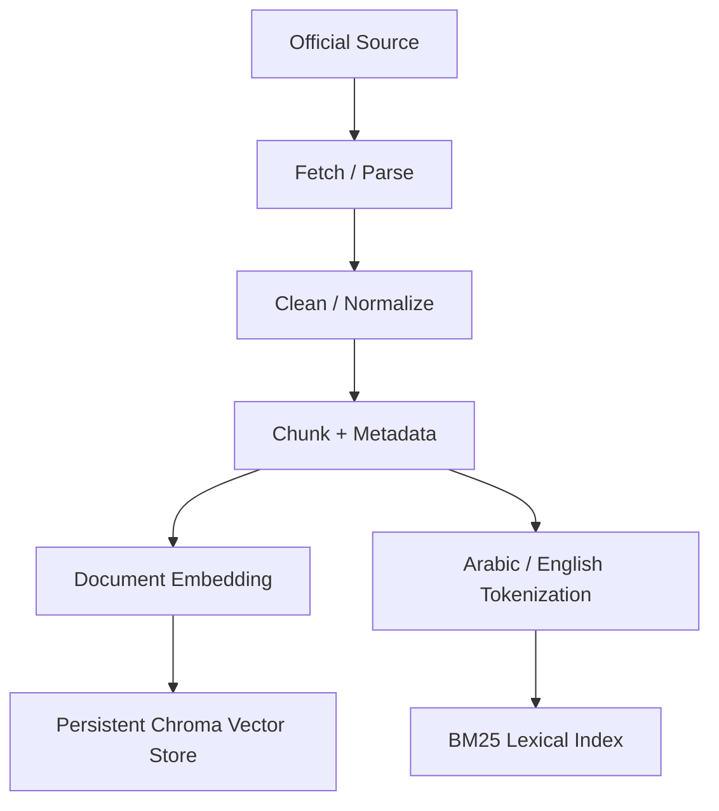

The vector and lexical search paths therefore originate from the **same underlying chunk corpus**, but represent the text differently.

This matters because semantic retrieval and lexical retrieval solve different failure modes.

---

## 8. Chunking

The current searchable corpus contains **164 chunks**.

Chunking converts full source documents into smaller retrieval units so that the system can:

- retrieve only the evidence relevant to the question;
- reduce unnecessary LLM context;
- preserve source-level metadata;
- rerank candidate evidence at chunk granularity;
- evaluate retrieval against manually assigned gold chunks.

The evaluation dataset explicitly refers to gold chunks, making chunk-level retrieval a first-class measurable component of the architecture.

### Why chunk-level evidence matters

If a full source were sent to the model every time:

- irrelevant text would increase context size;
- generation cost would increase;
- useful evidence could be diluted;
- retrieval quality would be more difficult to evaluate.

The project instead evaluates whether the required **gold chunk** is present in the top five retrieved chunks.

---

## 9. Metadata Design

The reranking pipeline enriches candidates with source metadata before final ranking.

The answer pipeline also constructs public source objects separately from the generated answer.

This design gives two useful outputs:

```text
Generated answer
+
Structured source attribution
```

rather than embedding raw internal retrieval metadata directly inside generated prose.

This separation supports:

- cleaner UI rendering;
- more reliable source cards;
- independent evaluation/debugging;
- safer removal of internal fields from public output.

---

## 10. Multilingual Embeddings

The implemented embedding model is:

```text
embed-multilingual-v3.0
```

Two input modes are used:

```text
search_document
search_query
```

### Offline

Corpus chunks are embedded using:

```text
input_type = search_document
```

### Query time

The user question is embedded using:

```text
input_type = search_query
```

This distinction is important because the embedding service is informed whether the text represents a retrievable document or a search query.

The architecture was designed for bilingual Arabic/English use, making a multilingual embedding model appropriate to the project domain.

---

## 11. Chroma Vector Store

The project uses persistent Chroma storage for semantic retrieval.

The source code opens a persistent Chroma client under the repository data directory and writes document vectors into that store.

At query time:

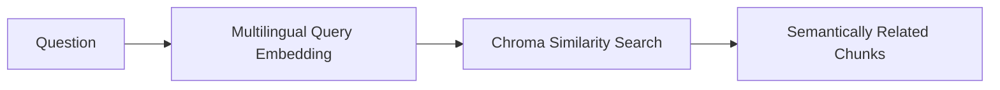

### Why vector search is useful

Vector retrieval can match conceptually related language even when the user does not use the exact words found in the source.

This is particularly relevant to bilingual or paraphrased questions.

### Measured evidence

Vector-only Recall@5:

**29/30 = 96.67%**

This shows that semantic retrieval alone was already strong, but not perfect.

---

## 12. BM25 Lexical Retrieval

The project also uses:

```text
rank_bm25.BM25Okapi
```

The implementation includes Arabic/English text normalization/tokenization for keyword retrieval.

The BM25 path receives the **raw query text** rather than the query embedding.

Conceptually:

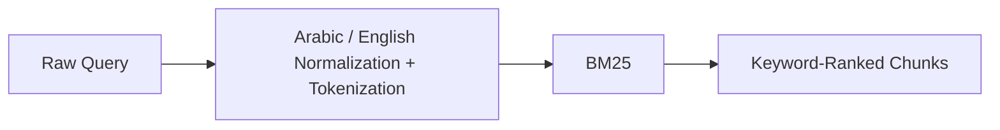

### Why BM25 is retained

Lexical retrieval is useful for:

- exact scholarship/program names;
- acronyms;
- named organizations;
- precise eligibility terminology;
- dates;
- unusual tokens;
- terms that semantic similarity may rank differently.

### Measured evidence

BM25-only Recall@5:

**24/30 = 80.00%**

This is weaker than vector-only retrieval on the complete golden set, but it supplies a complementary retrieval signal.

---

## 13. Hybrid Retrieval and Reciprocal Rank Fusion

The project combines vector and BM25 results into a hybrid candidate set.

The implemented hybrid retriever merges rankings using an RRF-style approach.

Conceptually:

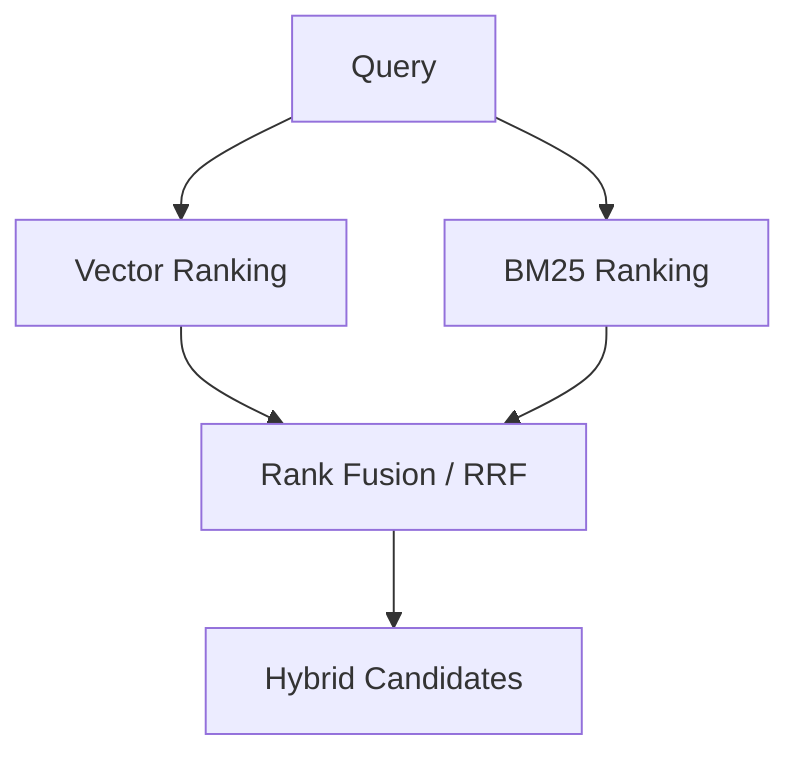

### Measured result before reranking

Hybrid (Vector + BM25 + RRF) Recall@5:

**27/30 = 90.00%**

This result is important because it prevents a misleading conclusion.

The raw hybrid merge was **not** better than vector-only retrieval on the final top-five metric:

| Retrieval method | Recall@5 |
|---|---:|
| Vector | 96.67% |
| BM25 | 80.00% |
| Hybrid + RRF | 90.00% |

Therefore the evidence does **not** support the statement:

> “Hybrid retrieval alone improved Recall@5 over vector retrieval.”

It did not.

The value of the hybrid design is demonstrated only after the next stage: reranking.

---

## 14. Cohere Multilingual Reranking

The implemented reranker model is:

```text
rerank-multilingual-v3.0
```

Current retrieval settings include:

```text
HYBRID_CANDIDATES = 20
TOP_N = 5
```

The pipeline therefore follows:

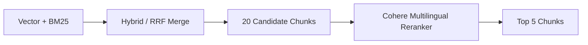

### Why reranking is important

The first retrieval stage is optimized for candidate recall.

The reranker then asks a stronger relevance model to reorder the candidate set with respect to the exact user query.

### Measured evidence

| Method | Hits | Recall@5 |
|---|---:|---:|
| Vector Search | 29/30 | 96.67% |
| BM25 | 24/30 | 80.00% |
| Hybrid + RRF | 27/30 | 90.00% |
| **Hybrid + Cohere Reranker** | **30/30** | **100.00%** |

Improvement from raw hybrid to reranked hybrid:

`100.00% - 90.00% = +10.00 percentage points`

Improvement from vector-only to final pipeline:

`100.00% - 96.67% = +3.33 percentage points`

The final retrieval architecture is therefore supported by direct experimental evidence.


---

## 15. Retrieval Robustness by Language

Final pipeline Recall@5:

| Language | Hits | Recall@5 |
|---|---:|---:|
| Arabic | 15/15 | 100.00% |
| English | 15/15 | 100.00% |

This result is important because the project explicitly targets bilingual users.

The final retrieval pipeline did not miss any required gold passage in either language subset.

---

## 16. Retrieval Robustness by Difficulty

Final Recall@5:

| Difficulty | Hits | Recall@5 |
|---|---:|---:|
| Easy | 7/7 | 100.00% |
| Medium | 12/12 | 100.00% |
| Hard | 11/11 | 100.00% |

All manually assigned required gold chunks were found in the final top five for every evaluated question.

This is stronger evidence than reporting only the overall 100% score because it shows that the result was not produced only by easy questions.

---

## 17. Golden-Set Definition

The retrieval evaluation uses:

**30 golden questions**

A question is counted as a Recall@5 hit when its required gold chunk appears among the top five retrieved chunks.

For questions with multiple required gold chunks, all listed required chunks must be present in the top five.

This is a strict query-level definition.

### Why this matters

A weaker evaluation could count a query as successful when only one of several required evidence chunks was present.

This project instead requires the complete listed gold evidence for multi-chunk questions.

---

## 18. Context Construction

After reranking, the final top-five chunks are used to build the LLM context.

The context builder combines:

- retrieved chunk text;
- source-related metadata.

This context is then provided to the generation pipeline.

Conceptually:


The aim is to force answer generation to operate on the retrieved evidence rather than relying on general model knowledge.

---

## 19. Configurable Generation (One-Pass Default, Two-Pass Benchmark)

The production RAG pipeline contains separate methods for:

```text
generate_draft_answer(...)
review_answer(...)
generate_answer(...)
```

The **public deployment default** is one grounded generation pass. A second draft-plus-context review can be re-enabled with:

```env
RAG_ENABLE_ANSWER_REVIEW=1
```

The complete generation decision flow is:

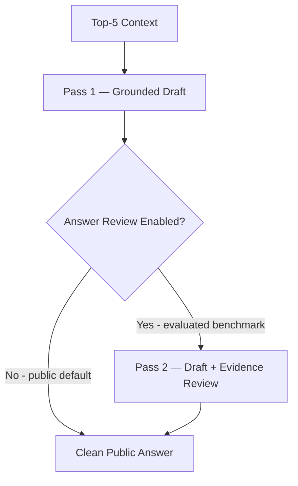

The measured cost profile confirms **2 Chat calls per normal query** across the 30-question benchmark because that benchmark used the evaluated two-pass path.

### Engineering rationale

A second pass can improve:

- faithfulness;
- precision;
- relevance;
- answer structure;
- removal of unsupported wording.

The trade-off is:

- higher token use;
- higher API cost;
- greater latency.

This trade-off is measured rather than hidden in the cost profile.

---

## 19.5 Production Reliability

The deployed system is designed to degrade gracefully instead of failing completely when an external AI dependency becomes unavailable.

Implemented reliability behavior includes:

- monthly/trial quota exhaustion treated as **non-retryable**;
- retries only for transient provider/network failures;
- vector-search fallback to BM25;
- reranker failure preserving the existing hybrid/BM25 ordering;
- generation failure returning retrieved official sources with a user-facing notice.

This separates core retrieval usability from third-party answer-generation availability.

## 20. Public Answer Cleanup

Before the answer reaches the public application, the pipeline applies answer-cleaning logic.

This is used to prevent internal implementation language or debugging-style retrieval details from appearing directly in user-facing output.

The public system should present:

- the answer;
- useful opportunity information;
- source attribution;

rather than internal implementation terms such as retrieval scores or chunk-debugging metadata.

---

## 21. Source Attribution

Sources are built separately from the answer.

The source objects can include fields such as:

- title;
- provider;
- category;
- URL;
- source ID;
- chunk IDs;
- rerank score for internal use.

This enables the UI to render professional source cards while retaining richer fields for evaluation/debugging.

Conceptually:

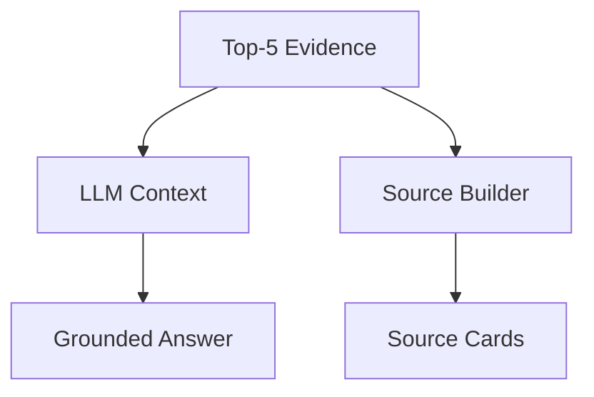

This is a stronger architecture than asking the LLM to invent or reconstruct citations from memory.

---

## 22. End-to-End Query Path

The complete implemented path can be summarized as:

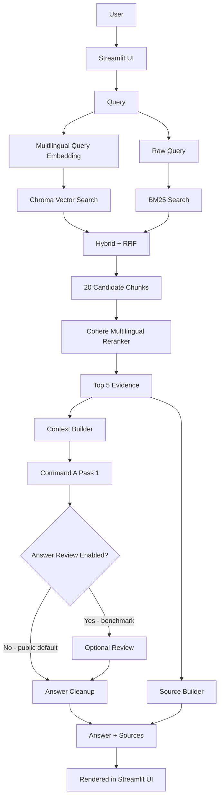

---

## 23. RAGAS Evaluation Design

RAGAS evaluation uses:

**20 questions**

selected from the 30-question golden set:

- Q01–Q20;
- 10 Arabic;
- 10 English.

For each sample:

- the evaluated RAG pipeline generated the answer using the published benchmark configuration;
- retrieved contexts came from the same retrieval/reranking path used by the application;
- reference answers were generated only from manually assigned gold chunks;
- reference generation was explicitly instructed not to use outside knowledge.

This is important because a RAG evaluation is meaningful only if the references represent the target source evidence.

---

## 24. RAGAS Results

| Metric | Valid samples | Score |
|---|---:|---:|
| Faithfulness | 20/20 | **0.9875** |
| Answer Relevancy | 20/20 | **0.8227** |
| Context Precision | 20/20 | **1.0000** |
| Context Recall | 20/20 | **1.0000** |

Project arithmetic summary:

**0.9526**

This value is a **project-level arithmetic mean of the four metric averages**, not a separate canonical RAGAS metric.


---

## 25. RAGAS Interpretation

### 25.1 Context Recall = 1.0000

The retrieved evidence covered the information required by the reference answers for the evaluated set.

Interpretation:

> The principal evaluation weakness is not missing reference evidence.

### 25.2 Context Precision = 1.0000

Relevant evidence was ranked strongly among the retrieved contexts.

Interpretation:

> The retrieval/reranking pipeline is supplying highly relevant evidence to the generation model.

### 25.3 Faithfulness = 0.9875

The generated claims were almost entirely supported by retrieved evidence.

Interpretation:

> Grounding is very strong, with a small remaining margin for unsupported or imperfectly supported wording.

### 25.4 Answer Relevancy = 0.8227

This is the lowest metric.

Interpretation:

> Some answers can be made more direct and more closely aligned with the exact wording/scope of the user's question, even when the answer is well grounded.

This creates a clear optimization direction:

**Improve directness without sacrificing faithfulness.**

---

## 26. RAGAS Results by Language

| Language | Metric | Score |
|---|---|---:|
| Arabic | Faithfulness | 1.0000 |
| Arabic | Answer Relevancy | 0.8108 |
| Arabic | Context Precision | 1.0000 |
| Arabic | Context Recall | 1.0000 |
| English | Faithfulness | 0.9750 |
| English | Answer Relevancy | 0.8347 |
| English | Context Precision | 1.0000 |
| English | Context Recall | 1.0000 |

These results show strong evidence retrieval in both languages.

They also indicate that answer relevancy remains the primary improvement area in both Arabic and English.

---

## 27. Cost Benchmark Methodology

The cost profiler sends every golden question through:

```text
YemenOpportunityRAG.ask()
```

It records billed API usage from:

- Chat;
- Embed;
- Rerank.

The benchmark completed:

**30 successful questions / 30**

with:

**0 failed final measurements**

The profiler preserves successful measurements so failed or interrupted runs do not require repaying for already completed questions.

---

## 28. Measured API Usage Distribution

| Metric | Mean | P50 | P95 | Maximum |
|---|---:|---:|---:|---:|
| Command A input tokens | 7,380.53 | 7,514.50 | 8,246.00 | 8,288.00 |
| Command A output tokens | 137.83 | 119.50 | 310.00 | 358.00 |
| Embedding input tokens | 24.33 | 24.50 | 32.00 | 34.00 |
| Rerank search units | 1.00 | 1.00 | 1.00 | 1.00 |
| Chat calls/query | 2.00 | 2.00 | 2.00 | 2.00 |
| Embed calls/query | 1.00 | 1.00 | 1.00 | 1.00 |
| Rerank calls/query | 1.00 | 1.00 | 1.00 | 1.00 |

This confirms the normal query structure:

```text
1 Embed call
+ 1 Rerank call
+ 2 Chat calls
= 4 principal API calls/query
```

before retries or other exceptional operations.

---

## 29. Generation Cost Formula

Command A pricing used by the benchmark:

```text
Input  = $2.50 / 1,000,000 tokens
Output = $10.00 / 1,000,000 tokens
```

Mean measured usage:

```text
Input tokens  = 7,380.53
Output tokens = 137.83
```

Mean input cost:

`7,380.53 × $2.50 / 1,000,000`

≈ `$0.0184513`

Mean output cost:

`137.83 × $10.00 / 1,000,000`

≈ `$0.0013783`

Combined generation cost from rounded mean values:

≈ `$0.0198296/query`

The row-level measured benchmark mean is:

**$0.01982967/query**

The tiny difference is caused by rounding the displayed aggregate token means.

---

## 30. Generation Cost Distribution

| Metric | USD/query |
|---|---:|
| Mean | **$0.01982967** |
| P50 | **$0.02006375** |
| P95 | **$0.02205750** |
| Maximum observed | **$0.02419500** |

Interpretation:

- **Mean** → expected average economic cost;
- **P50** → typical median query;
- **P95** → conservative operating budget;
- **Maximum** → observed benchmark stress case.

---

## 31. Cost Scaling

Generation-only monthly projection:

| Queries/month | Mean | P95 | Maximum observed |
|---:|---:|---:|---:|
| 1,000 | $19.83 | $22.06 | $24.20 |
| 10,000 | $198.30 | $220.58 | $241.95 |
| 100,000 | $1,982.97 | $2,205.75 | $2,419.50 |
| 1,000,000 | $19,829.67 | $22,057.50 | $24,195.00 |


These values exclude:

- Embed PAYG dollars until the exact production rate is verified;
- Rerank PAYG dollars until the exact production rate is verified;
- hosting;
- database;
- domain;
- support;
- taxes;
- other production overhead.

Therefore they should be described as **generation cost**, not total system COGS.

---

## 32. Benchmark Run Economic Value

Measured production-equivalent Command A generation cost for the complete successful benchmark:

**$0.594890**

This economic value is useful even if the development environment is currently using a free trial key, because the commercial model must reflect production-equivalent resource consumption rather than only the current invoice.

---

## 33. Latency Benchmark

Measured end-to-end latency:

| Metric | Seconds |
|---|---:|
| Mean | **13.754** |
| P50 | **10.945** |
| P95 | **32.381** |
| Maximum | **70.093** |


### Interpretation

The median provides a more representative normal benchmark than the maximum.

The high maximum includes observed transient network/retry effects and should not be described as pure model inference latency.

Latency includes the end-to-end RAG path, including:

- retrieval;
- reranking;
- two Chat generation passes;
- network/API time;
- retry effects where applicable.

---

## 34. Language Cost Comparison

Measured generation cost:

| Language | N | Mean generation cost | P95 generation cost |
|---|---:|---:|---:|
| Arabic | 15 | $0.02097017 | $0.02419500 |
| English | 15 | $0.01868917 | $0.02130250 |

Observed mean cost difference:

`($0.02097017 / $0.01868917 - 1) × 100`

≈ **12.20%**

Arabic was approximately 12.20% more expensive in this benchmark sample.

This should **not** be generalized into a universal claim that Arabic queries are always 12.20% more expensive.


---

## 35. Language Latency Comparison

Measured mean end-to-end latency:

| Language | Mean latency |
|---|---:|
| Arabic | 17.198 s |
| English | 10.311 s |


This difference is a benchmark observation, not proof that language alone caused the entire latency difference.

Potential contributing factors can include:

- question complexity;
- generated answer length;
- network timing;
- retries;
- model behavior.

A larger controlled benchmark would be required for a causal claim.

---

## 36. Reliability and Retry Engineering

During cost profiling, transient connectivity failures were observed.

The cost profiler was therefore designed to:

- cache successful questions;
- discard stale failed rows during resume;
- retry failed questions;
- avoid re-running already successful questions.

The final benchmark reached:

**30/30 successful measurements**

This is operationally important because evaluation tooling should itself be restart-safe when API calls have financial cost.

---

## 37. Evaluation Failures as Engineering Evidence

The project encountered real implementation/evaluation problems during development.

Examples include:

### 37.1 API quota issue

An OpenAI evaluation call returned an insufficient-quota error.

Engineering response:

- evaluation was moved to the available Cohere path.

### 37.2 RAGAS completion detection

RAGAS initially produced `LLMDidNotFinishException` behavior with Cohere responses.

Engineering response:

- a custom completion parser was added to recognize Cohere `COMPLETE` finish semantics.

### 37.3 Cost-profile DNS/network failure

Early cost profiling experienced transient `getaddrinfo failed` retrieval/reranking failures.

Engineering response:

- successful rows were preserved;
- failed rows could be retried safely;
- question-level retry behavior was added;
- final profiling completed 30/30.

### Why document failures?

A production-oriented engineering report should show:

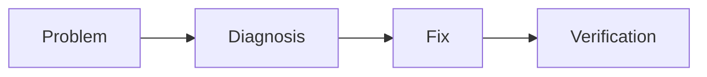

rather than presenting only the final success state.

---

## 38. Authentication Layer

The web application includes a Supabase authentication layer.

The architecture diagram represents:

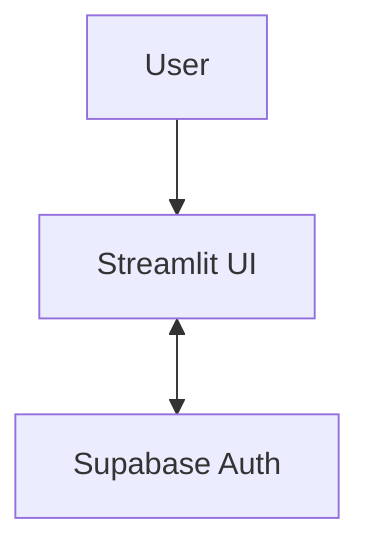

Authentication is separate from retrieval and generation.

This separation is useful because identity/session management is an application concern, while the RAG pipeline is a knowledge-retrieval/generation concern.

The final security review should continue to verify:

- no API keys are committed;
- `.env` remains ignored;
- Streamlit secrets remain ignored;
- production credentials stay in deployment secret storage.

---

## 39. Streamlit Application Layer

Streamlit provides the current user-facing application.

Its responsibilities include:

- receiving the query;
- handling authenticated application state;
- calling the RAG pipeline;
- displaying the final answer;
- displaying source attribution.

The RAG pipeline should remain logically separable from the UI so that the retrieval/generation backend can later be moved behind an API or another front end if needed.

---

## 40. Source Attribution as a User-Safety Feature

For opportunity discovery, source attribution is more than UI decoration.

A user may need to verify:

- deadline;
- funding;
- eligibility;
- required documents;
- official application page.

A generated answer without the underlying official source is less useful for high-stakes application decisions.

Therefore the architecture treats source metadata as part of the final product output.

---

## 41. Current Strengths

### Retrieval

- 100% Recall@5 on the 30-question golden set.
- 100% Arabic Recall@5.
- 100% English Recall@5.
- 100% across easy, medium, and hard subsets.

### Evidence ranking

- RAGAS Context Precision = 1.0000.
- RAGAS Context Recall = 1.0000.

### Grounding

- Faithfulness = 0.9875.

### Reproducibility

- retrieval evaluation scripts;
- RAGAS scripts;
- cost profiler;
- stored CSV results;
- Markdown summaries;
- chart generators;
- Git-tracked evidence artifacts.

### Financial observability

- actual billed units measured from API responses;
- mean/P50/P95/max cost;
- query-volume projections.

---

## 42. Current Weaknesses

### 42.1 Answer relevancy

RAGAS Answer Relevancy:

**0.8227**

This is the clearest measured generation-quality weakness.

### 42.2 Latency tail

P95:

**32.381 s**

Maximum:

**70.093 s**

The maximum was influenced by retry/network effects, but the tail remains important operational evidence.

### 42.3 Small evaluation set

- retrieval: 30 questions;
- RAGAS: 20 questions.

These are appropriate for the capstone but not sufficient to characterize every future production query.

### 42.4 Current corpus size

The validated processed corpus is small relative to a large production service.

Performance at 164 chunks does not prove identical latency or ranking characteristics at hundreds of thousands or millions of chunks.

### 42.5 Incomplete full-variable AI dollar cost

Embed and Rerank usage is measured, but the financial model intentionally leaves their exact dollar rates open until verified production pricing is available for the exact deployed model/version.

---

## 43. Why the Final Retrieval Choice Is Defensible

The final architecture was not selected only because hybrid RAG is fashionable.

The measured evidence is:

```text
Vector only              96.67%
BM25 only                80.00%
Hybrid + RRF             90.00%
Hybrid + Reranker       100.00%
```

This leads to a specific conclusion:

> The decisive improvement came from reranking the broader hybrid candidate set, not from the raw hybrid merge alone.

That distinction should be preserved in the ADR.

---

## 44. Why Top 20 → Top 5 Is Defensible

Current settings:

```text
Hybrid candidates = 20
Final reranked contexts = 5
```

The pipeline intentionally separates:

- candidate breadth;
- final context precision.

The first stage allows multiple retrieval signals to contribute candidates.

The reranker then compresses the candidate pool to the evidence sent to generation.

The 100% Recall@5 result provides empirical support that this configuration is sufficient for the current golden set.

It does not prove that 20/5 is globally optimal for all future datasets.

---

## 45. Why the Optional Two-Pass Review Is a Trade-off

The published benchmark configuration used:

```text
2 Chat calls/query
```

The current public default uses one Chat call per uncached normal query; the second review pass is optional.

This contributes directly to:

- generation cost;
- latency.

However the final quality profile also shows very high:

- Faithfulness = 0.9875;
- Context Precision = 1.0000;
- Context Recall = 1.0000.

The architecture therefore makes an explicit quality-vs-cost/latency trade-off.

A future optimization could make the second pass conditional, but this should only be adopted after repeating RAGAS and confirming that quality does not regress materially.

---

## 46. Production Optimization Opportunities

Potential next-stage optimizations:

1. Cache repeated or semantically equivalent queries.
2. Make the review pass conditional on a quality/risk gate.
3. Route simple questions to a cheaper generation model.
4. Preserve Command A for complex eligibility/comparison questions.
5. Add production usage logging for billed tokens and search units.
6. Add latency tracing by stage:
   - embedding;
   - vector retrieval;
   - BM25;
   - reranking;
   - draft generation;
   - review generation.
7. Expand the golden set.
8. Add date/status freshness checks for opportunity data.
9. Automate source refresh validation.
10. Introduce query/user quotas for predictable unit economics.

---

## 47. Scale Considerations

The current vector store is appropriate for the capstone-scale corpus.

If the knowledge base grows materially, future evaluation should include:

- indexing time;
- vector-store memory/disk behavior;
- query concurrency;
- rerank candidate cost;
- cache hit rate;
- database/network limits;
- high-availability requirements.

A managed vector database should not be adopted merely because it is more complex; it should be justified by measured scale and operational requirements.

---

## 48. Data Freshness Risk

Opportunity information changes over time.

Potentially time-sensitive fields include:

- open/closed status;
- deadline;
- funding;
- eligibility;
- location;
- application URL.

Therefore a production deployment should treat freshness as a separate quality dimension from retrieval accuracy.

A perfect Recall@5 score against stale documents would still produce an operationally poor opportunity service.

---

## 49. Evaluation Limitations

The reported scores are valid for the evaluated datasets and methodology.

They should not be interpreted as:

- a guarantee for every possible user query;
- a claim of perfect production accuracy;
- proof that no hallucination can occur;
- proof that the same scores persist after corpus/model changes.

Every meaningful architecture change should trigger relevant regression evaluation.

Examples:

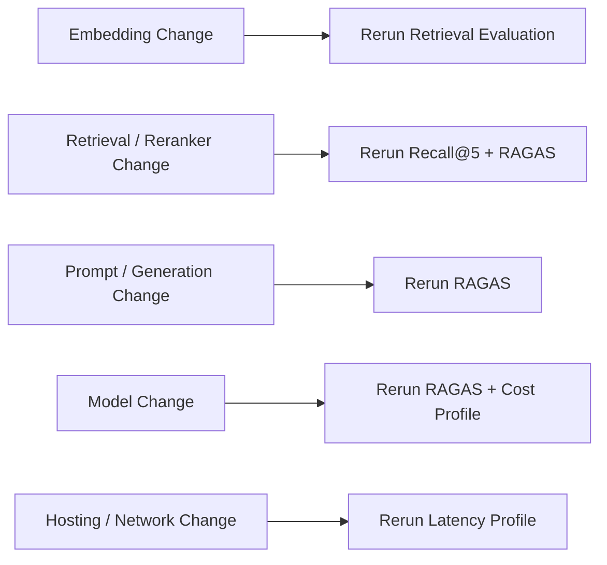

---

## 50. Reproducibility Workflow

### Recall@5

```powershell
.\.venv\Scripts\python.exe .\evaluation\recall_eval.py
```

Outputs include:

```text
evaluation/recall_results.csv
evaluation/recall_summary.md
```

### RAGAS

```powershell
.\.venv\Scripts\python.exe .\evaluation\ragas_eval.py
```

Outputs include:

```text
evaluation/ragas_results.csv
evaluation/ragas_summary.md
```

### Cost profiling

```powershell
.\.venv\Scripts\python.exe .\evaluation\investor_cost_profile.py
```

Outputs include:

```text
evaluation/investor_cost_profile.csv
evaluation/investor_cost_summary.md
```

### Evidence charts

```powershell
.\.venv\Scripts\python.exe .\docs\generate_evidence_charts.py
```

### Architecture diagram

```powershell
.\.venv\Scripts\python.exe .\docs\generate_architecture_diagram.py
```

---

## 51. Git Traceability

Important development milestones visible in the evidence snapshot include:

```text
7435677  Add investor-grade cost analysis and measured cost profile
9812765  Add reproducible RAGAS refresh workflow
fd302fa  Improve RAG answer quality and RAGAS score to 0.9526
36764e0  Add RAGAS evaluation and update dependencies
1b10083  Complete authentication flow with usernames
cc14bfe  Complete authentication flow
e31acdf  Improve authentication and email verification flow
9147b56  Fix Supabase email verification redirect
fe34edc  Prepare Yemen Opportunity Navigator for Streamlit deployment
```

Git history therefore acts as part of the project audit trail.

---

## 52. Documentation Corrections Before Final Submission

Two documentation items should be reviewed before the final submission package is frozen.

### 52.1 Corpus count

Current processed evidence:

**49 source records**

Existing `domain.md` wording:

**50 curated sources**

Action:

Update the wording so it distinguishes the originally designed source list from the current validated processed corpus.

### 52.2 Architecture document location

The evidence snapshot shows:

```text
src/architecture.md
```

while a root-level `architecture.md` was not captured by the evidence script.

If the capstone submission expects `architecture.md` at repository root, either:

- move/copy the canonical architecture document to the expected root location; or
- make the README clearly link to its actual location.

Do not keep two diverging architecture documents.

---

## 53. Evidence Matrix

| Claim | Evidence |
|---|---|
| Bilingual retrieval | Arabic/English BM25 + multilingual embeddings + language evaluation |
| Embedding model | `embed-multilingual-v3.0` |
| Vector DB | Persistent Chroma |
| Keyword retrieval | BM25Okapi |
| Hybrid retrieval | Vector + BM25 + RRF |
| Reranker | `rerank-multilingual-v3.0` |
| Candidate count | 20 |
| Final context count | 5 |
| Final Recall@5 | 30/30 = 100% |
| Arabic Recall@5 | 15/15 = 100% |
| English Recall@5 | 15/15 = 100% |
| Hard-question Recall@5 | 11/11 = 100% |
| RAGAS Faithfulness | 0.9875 |
| RAGAS Answer Relevancy | 0.8227 |
| RAGAS Context Precision | 1.0000 |
| RAGAS Context Recall | 1.0000 |
| Project metric mean | 0.9526 |
| Cost benchmark | 30/30 successful |
| Mean generation cost | $0.01982967/query |
| P95 generation cost | $0.02205750/query |
| P50 latency | 10.945 s |
| P95 latency | 32.381 s |
| Chat calls/query | 2 |
| Embed calls/query | 1 |
| Rerank calls/query | 1 |

---

## 54. Technical Conclusion

The project evidence supports the following engineering conclusion:

Yemen Opportunity Navigator is not implemented as a simple “chat with documents” prototype.

It contains a measurable multilingual RAG pipeline with:

- source curation;
- chunk-level retrieval;
- multilingual semantic search;
- lexical search;
- hybrid fusion;
- learned reranking;
- grounded two-stage generation;
- explicit source attribution;
- bilingual evaluation;
- retrieval regression testing;
- RAGAS generation evaluation;
- API usage measurement;
- cost projection;
- latency measurement;
- reproducible evidence charts;
- deployment/authentication integration.

The strongest evidence is the combination of:

```text
Recall@5                         100% (30/30)
Context Precision               1.0000
Context Recall                  1.0000
Faithfulness                    0.9875
Project arithmetic metric mean  0.9526
```

The most important measured improvement opportunity is:

```text
Answer Relevancy = 0.8227
```

The most important operational improvement area is the latency tail:

```text
P95 latency = 32.381 s
```

The most important documentation correction is the difference between:

```text
50 source IDs originally described
vs.
49 currently validated processed source records
```

The resulting architecture is defensible because its key retrieval decision is backed by measured evidence:

```text
Raw Hybrid Recall@5       90.00%
Final Reranked Recall@5  100.00%
```

The next architectural documentation step is to compress these findings into a concise Architecture Decision Record (ADR) that states:

- the decision;
- the alternatives;
- the measured evidence;
- the trade-offs;
- the consequences.

That ADR should remain concise, while this report serves as the detailed technical appendix and evidence base.
