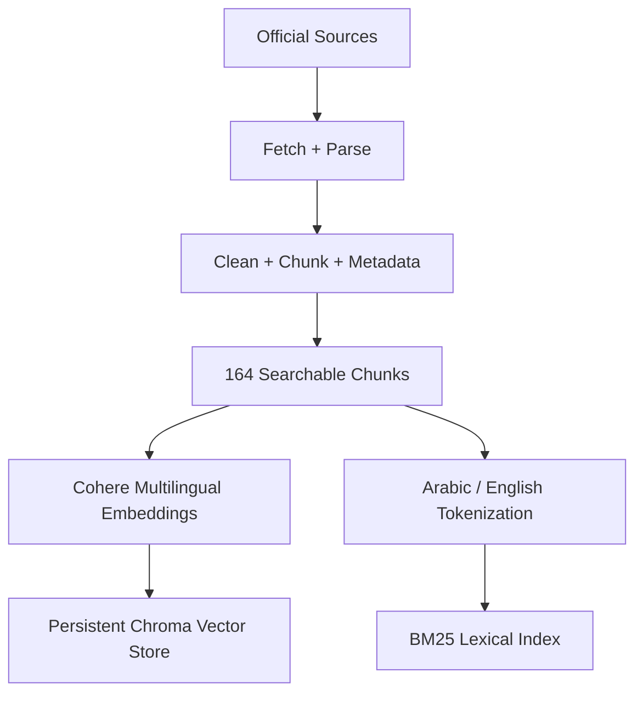
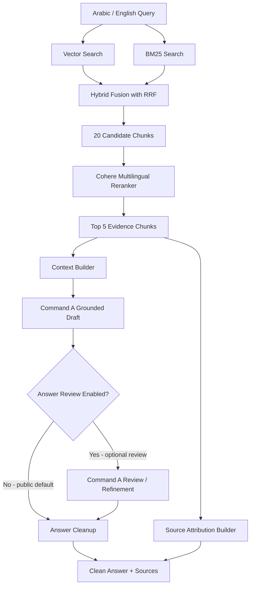

# Yemen Opportunity Navigator

## Domain Definition

### Project Overview

Yemen Opportunity Navigator is a bilingual Retrieval-Augmented Generation (RAG) system designed to help Yemeni youth discover reliable educational, professional, entrepreneurial, and innovation opportunities.

The system allows users to ask questions in Arabic or English about scholarships, fellowships, internships, training programs, grants, competitions, startup accelerators, and selected remote and technology opportunities.

Unlike a general-purpose chatbot, the system retrieves evidence from a curated collection of trusted first-party or official sources, reranks the retrieved evidence, and generates answers grounded in those sources with source attribution.

## Problem Statement

Young people in Yemen often face difficulty discovering suitable international opportunities because information is distributed across many websites, universities, international organizations, and application portals.

Applicants may need to investigate multiple websites to determine:

- whether applicants from Yemen are eligible;
- application deadlines;
- funding availability;
- academic requirements;
- age requirements;
- required documents;
- whether the opportunity is online or in person;
- and whether the opportunity matches their background.

This creates an information-access and verification problem.

## Proposed Solution

Yemen Opportunity Navigator centralizes a curated opportunity knowledge base behind a bilingual RAG assistant.

Users can ask questions such as:

- Which fully funded scholarships accept applicants from Yemen?
- What AI training opportunities are available?
- Which programs are suitable for computer science graduates?
- What documents are required for a specific fellowship?
- Which opportunities are currently open?

For each query, the system retrieves relevant evidence, reranks candidate chunks, generates a grounded answer, and returns source attribution so the user can verify important details.

## Target Users

The primary target users are Yemeni youth, including:

- university students;
- recent graduates;
- young professionals;
- researchers;
- startup founders;
- technology students;
- applicants seeking international opportunities.

## Knowledge Categories

The knowledge base covers:

1. Scholarships
2. Fellowships
3. Internships
4. Training programs
5. Innovation competitions
6. Startup accelerators
7. Grants
8. Remote and technology opportunities

## Data Sources

The source collection was designed around **50 candidate source IDs**.

After fetching, parsing, source-quality auditing, source replacement where needed, and manual review, the current validated processed corpus contains **49 usable source records**. `OPP-021` is absent from the processed corpus because that candidate source could not be retrieved reliably after repeated access failures.

The current searchable corpus contains **164 validated chunks**.

Sources are selected primarily from:

- governments;
- universities;
- United Nations organizations;
- international development institutions;
- official scholarship programs;
- technology organizations;
- official innovation and startup programs.

Each source record can include metadata such as:

- source ID;
- title;
- provider;
- category;
- official URL;
- eligibility information;
- funding information;
- deadline;
- opportunity status;
- language;
- date last verified.

## Languages

The system supports Arabic and English queries.

The knowledge base is primarily English-language content, while multilingual retrieval enables Arabic questions to retrieve relevant English evidence.

## Implemented RAG Architecture

The implemented pipeline is:

### Offline ingestion flow

### Query-time flow

The current implementation uses:

- embedding model: `embed-multilingual-v3.0`;
- vector database: Chroma;
- lexical retrieval: BM25;
- hybrid fusion: Reciprocal Rank Fusion (RRF);
- reranker: `rerank-multilingual-v3.0`;
- hybrid candidate count: 20;
- final reranked context count: 5;
- generation model: `command-a-03-2025`.

## Evaluation

Retrieval is evaluated with a manually prepared 30-question golden set using Recall@5.

Measured Recall@5:

| Retrieval method | Recall@5 |
|---|---:|
| Vector Search | 96.67% |
| BM25 | 80.00% |
| Hybrid (Vector + BM25 + RRF) | 90.00% |
| Hybrid + Cohere Reranker | **100.00%** |

The final retrieval pipeline achieved:

- Arabic: 15/15 = 100%;
- English: 15/15 = 100%;
- Easy: 7/7 = 100%;
- Medium: 12/12 = 100%;
- Hard: 11/11 = 100%.

Generation quality is evaluated with RAGAS on 20 questions: 10 Arabic and 10 English.

Measured RAGAS results:

| Metric | Score |
|---|---:|
| Faithfulness | 0.9875 |
| Answer Relevancy | 0.8227 |
| Context Precision | 1.0000 |
| Context Recall | 1.0000 |

The project-level arithmetic mean across these four metric averages is **0.9526**. This mean is a project summary, not a separate canonical RAGAS metric.

## Deployment and Application Layer

The current application uses:

- Streamlit for the web interface;
- Supabase for authentication and sessions;
- Streamlit Community Cloud for the live demo deployment;
- GitHub for source control and deployment integration.

The current prototype can operate using free/trial service tiers, while commercial production costs are modeled separately in `cost_analysis.md`.

## Project Goal

The goal is to demonstrate a production-oriented RAG engineering workflow rather than a simple PDF chatbot.

The implemented project demonstrates:

- curated source collection;
- document ingestion and parsing;
- source and chunk quality auditing;
- multilingual processing;
- semantic retrieval;
- BM25 lexical retrieval;
- hybrid retrieval with RRF;
- multilingual reranking;
- grounded one-pass generation by default, with an optional second review pass;
- source attribution;
- authentication;
- deployment;
- Recall@5 evaluation;
- RAGAS evaluation;
- cost profiling;
- latency profiling;
- reproducible evidence charts;
- and documented production trade-offs.

Detailed engineering evidence is available in:

- `architecture.md`
- `ADR.md`
- `docs/technical_evidence.md`
- `cost_analysis.md`
